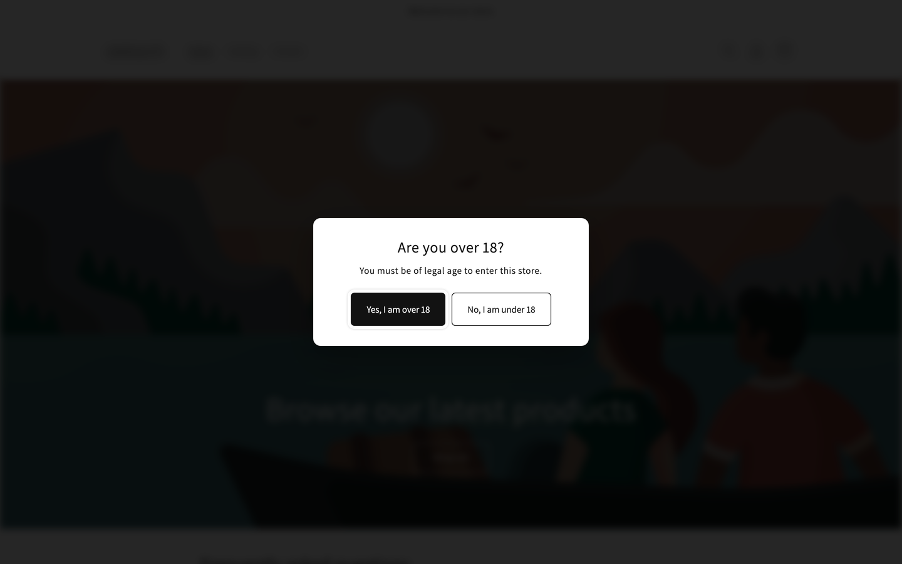
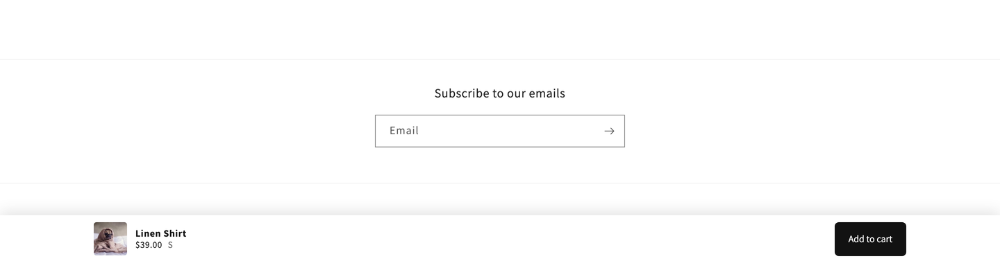
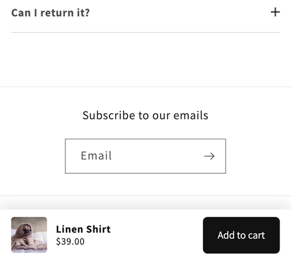
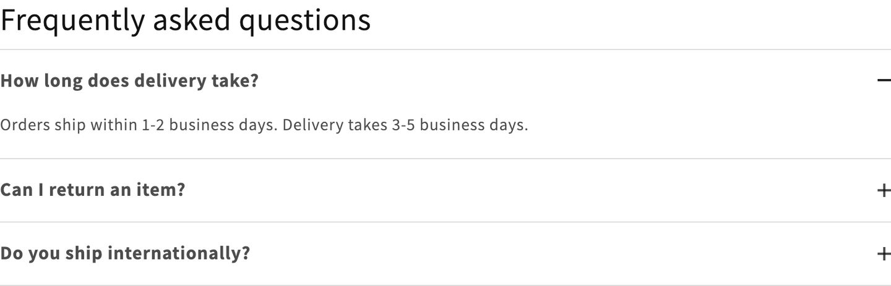
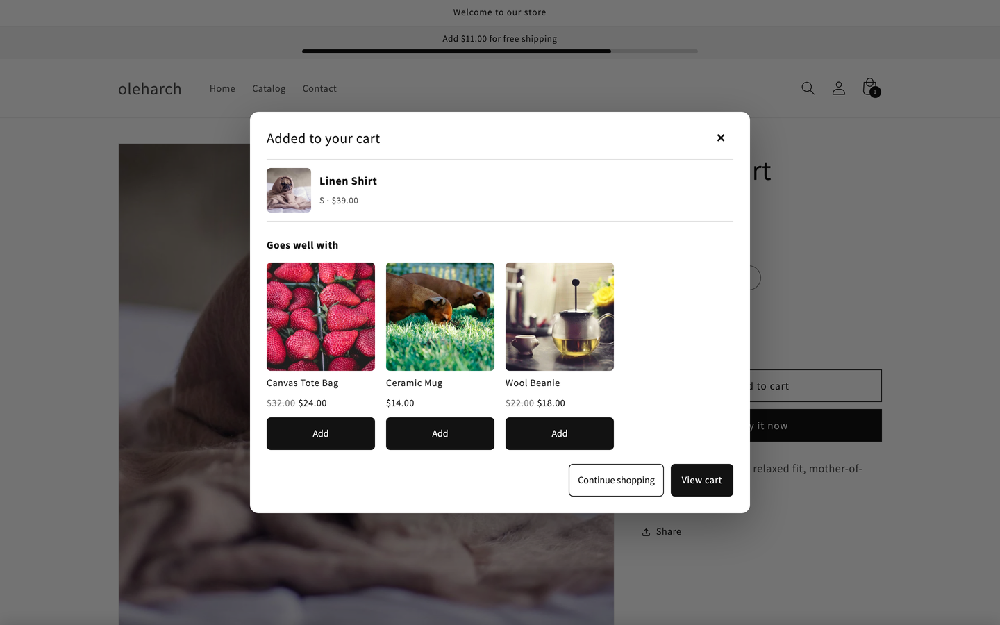
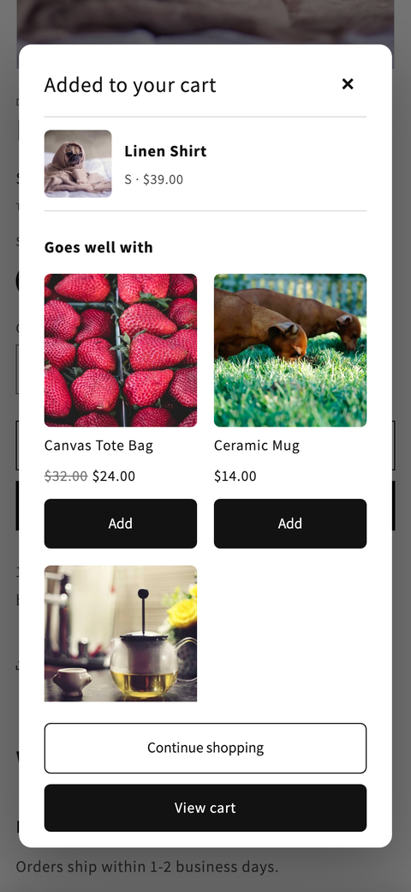
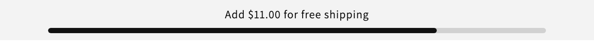

# Dawn sections

Drop-in sections for Shopify **Dawn** and any Online Store 2.0 theme. Each section is one Liquid file
(plus one small JS file when it needs behaviour): copy, add in the theme editor, done.

No jQuery, no build step, no app. Settings are editable by the merchant, styles are scoped to the
section, scripts are custom elements loaded with `defer`. Every file passes
[Shopify Theme Check](https://shopify.dev/docs/storefronts/themes/tools/theme-check) with zero offenses.
Cart work goes through the documented
[Ajax Cart API](https://shopify.dev/docs/api/ajax/reference/cart) and
[Section Rendering API](https://shopify.dev/docs/api/ajax/section-rendering), so Dawn's own cart drawer,
notification and error handling keep working.

| Section | What it does | Files |
|---|---|---|
| [Age gate](#age-gate) | Full-screen "Are you over 18?" dialog with cookie, redirect and blur. Works on every page. | `sections/age-gate.liquid`, `assets/age-gate.js` |
| [Sticky add to cart](#sticky-add-to-cart) | Bar that appears when the product form scrolls away. Submits the real form, follows the variant. | `sections/sticky-add-to-cart.liquid`, `assets/sticky-add-to-cart.js` |
| [FAQ](#faq) | Accordion on native `<details>`, open-one-at-a-time, FAQPage JSON-LD. No JavaScript. | `sections/faq.liquid` |
| [Upsell modal](#upsell-modal) | Opens after add to cart with related, complementary or hand-picked products. Prices and variants rendered by Liquid. | `sections/upsell-modal.liquid`, `assets/upsell-modal.js` |
| [Free shipping bar](#free-shipping-bar) | "Add 20.00 for free shipping" with a progress bar, re-rendered by Liquid after every cart change. Snippet for the cart drawer. | `sections/free-shipping-bar.liquid`, `snippets/free-shipping-bar.liquid`, `assets/free-shipping-bar.js` |

## Install

1. Copy the section file into your theme's `sections/` folder, the script (if any) into `assets/`, the snippet (if any) into `snippets/`.
2. Open the theme editor, click **Add section** and pick it by name. Sections that work on every page (age gate, upsell modal, free shipping bar) go into the **Header** or **Footer** group.
3. Fill in the settings. That is all.

Tested on Dawn 16 (screenshots below are from a Dawn 16 dev store). Other OS 2.0 themes work too; the notes under each section say what to check.

## Age gate



Made for vape, alcohol, CBD and adult stores. Built from a production store that had to block
under-age visitors on every page, including collection and product pages opened from ads.

- Add it to the **Header** or **Footer** section group so it covers every template.
- Remembers the answer in a cookie (`age_gate_ok`, 1 to 365 days).
- "No" sends the visitor to any URL (Google by default).
- Optional blur of the page behind the dialog, logo, all texts and colours in settings.
- Accessible: `role="dialog"`, `aria-modal`, focus moves to the first button, Tab stays inside, page scroll is locked. Escape is ignored on purpose.
- In the theme editor the dialog opens when you select the section and closes when you deselect it, so you can style it without clearing cookies.

Other themes: the blur targets `#MainContent`, `header`, `footer` and the header and footer section groups. Change the selector list in `blurTargets()` if your theme uses other wrappers.

## Sticky add to cart



A bottom bar with image, title, price, selected variant and an Add to cart button.

- Shows when the main Add to cart button leaves the viewport (`IntersectionObserver`), hides when you scroll back up.
- The button carries a `form` attribute pointing at the real product form, so the theme's own add-to-cart code runs: cart drawer, cart notification, error messages, quantity rules.
- Follows the selected variant: price and compare-at price (formatted by Liquid `money`, not by JS), availability ("Sold out"), variant title and image.
- Variant changes come from Dawn's pub/sub (`variant-change`) when available, with a fallback on the form's hidden `id` input for any other theme.
- Mobile and desktop can be switched on and off separately. Safe-area padding for phones with a home indicator.



Other themes: the script looks for a `form[action*="/cart/add"]` with `input[name="id"]` and a submit button, outside dialogs and quick-add or upsell modals, preferring one inside `#MainContent` (Dawn's installments form has no button and is skipped). If your theme renders a quick-add form higher in the DOM, move this section above it in the template or narrow the selector in `findProductForm()`.

## FAQ



- Native `<details>`/`<summary>`: works with keyboard and screen readers without a line of JavaScript.
- "Open one question at a time" uses the `name` attribute on `<details>` (Chrome 120+, Safari 17.2+, Firefox 130+). Older browsers simply allow several questions open at once.
- Smooth open and close where the browser supports `interpolate-size` and `::details-content`; instant elsewhere.
- Optional **FAQPage** JSON-LD built from the same blocks, for rich results in Google.
- Uses Dawn colour schemes (`color_scheme` setting). On other themes delete that setting or map it to your theme's scheme classes.

## Upsell modal



Opens right after a product is added to the cart, shows what was added and offers more products.

- **Products**: Shopify's related or complementary recommendations
  ([Product Recommendations API](https://shopify.dev/docs/api/ajax/reference/product-recommendations)),
  or a manual list picked in the editor. Complementary recommendations need the free
  [Search & Discovery](https://apps.shopify.com/search-and-discovery) app; without it Shopify falls back to related products.
- **Rendering**: the recommendations request is made with `section_id`, so the modal's product cards are rendered by this
  section's Liquid. Prices, compare-at prices, variant selects and images are formatted by the shop, not rebuilt in JS.
- **Adding from the modal**: the form posts to `/cart/add.js` with the `sections` parameter from the theme's own
  `cart-drawer` / `cart-notification` element and hands the response to `renderContents()`, exactly like Dawn's product form.
  The modal closes and the drawer opens with the new item.
- **Trigger**: Dawn's pub/sub `cart-update` event (product forms, quick add). Adds made from the cart page or the drawer's
  quantity controls do not open it. Other themes can trigger it with
  `document.dispatchEvent(new CustomEvent('cart:added', { detail: lineItem }))` where `lineItem` is the `/cart/add.js` response.
- Native `<dialog>`: Escape, focus and the backdrop are handled by the browser. "Show once per session" option.
- Theme editor: opens when you select the section (with the manual list, or empty if recommendations mode).



Other themes: without Dawn's `cart-drawer` element the modal still adds to the cart, closes and dispatches
`cart:added`; wire your cart UI to that event.

## Free shipping bar



Progress to the free shipping threshold, for the header, the cart page or the cart drawer.

- All math and money formatting happen in Liquid: `remaining = threshold - cart.total_price`, formatted with `money`.
  The JavaScript only re-fetches the section through the Section Rendering API after a cart change.
- Listens to Dawn's `cart-update` event and to `cart:updated` / `cart:added` DOM events for other themes.
- `[amount]` in the text is replaced with the remaining amount. Separate text once the goal is reached, separate bar colour.
- Hides when the cart is empty (optional) and when the cart is in another currency than the store (Markets): the threshold is
  entered in the store currency, so comparing it with a converted total would be wrong. For per-market thresholds render the
  snippet with a different `threshold` per `localization.country`.
- `role="progressbar"` with `aria-valuenow`, text in an `aria-live` region.

**Inside Dawn's cart drawer.** The drawer is re-rendered by Dawn after every change, so the snippet alone is enough. In
`sections/cart-drawer.liquid`, above the items, add:

```liquid

```

`threshold` is in cents of the store currency (50.00 is `5000`). The styles live in the section file; when you use only the
snippet, copy the `.free-shipping-bar*` rules into your theme CSS. Keep `display: block` on the fill: Dawn's `div:empty { display: none }` would hide it otherwise.

## Roadmap

- Store availability per location on the product page
- Product tabs from metafields
- Size chart modal from a metafield
- Back in stock form through a webhook

Open an issue to request a section. Stars and forks are welcome, they show which sections people actually use.

## Author

[Oleh Molchanov](https://oleh-molchanov.vercel.app), Shopify developer, Kyiv. Also on
[LinkedIn](https://www.linkedin.com/in/olehmolchanov/).

## License

MIT
